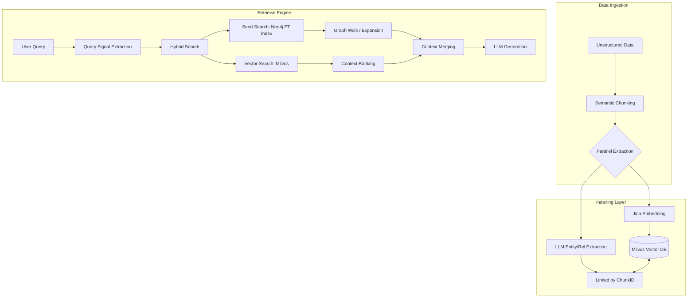
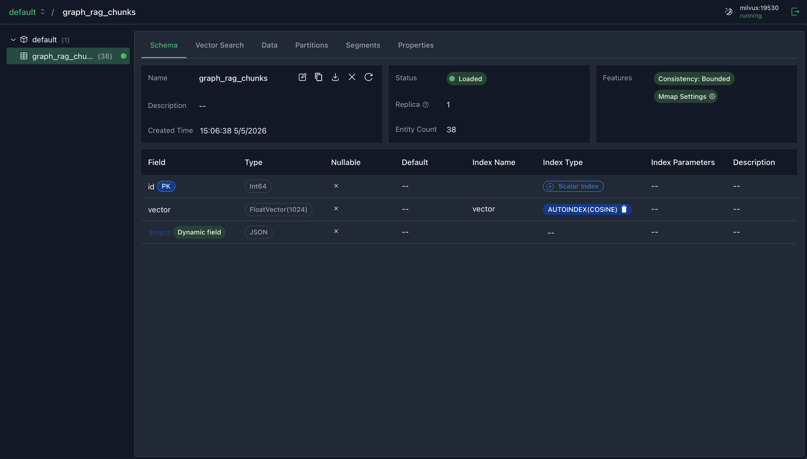
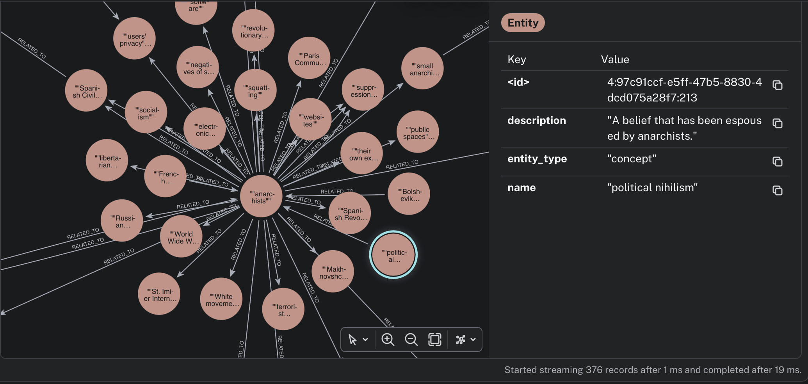
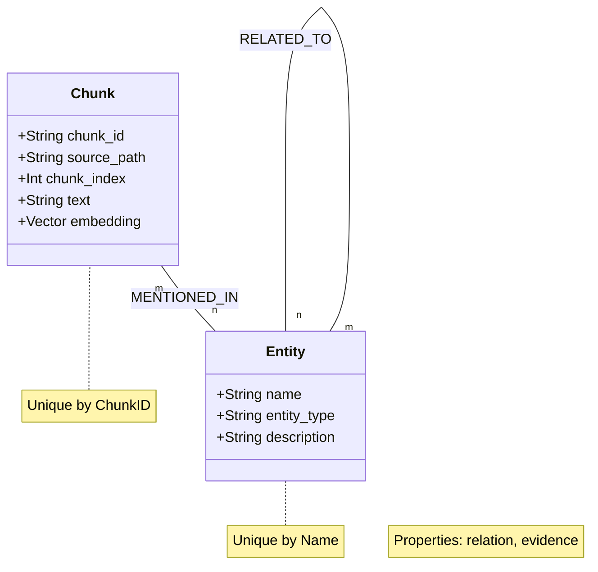
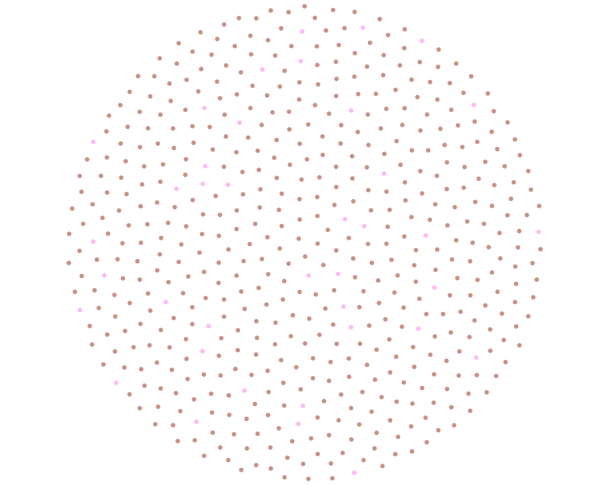
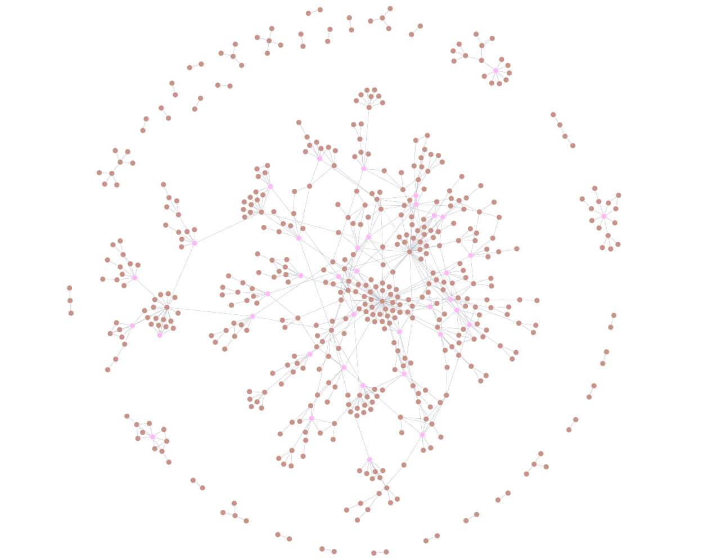
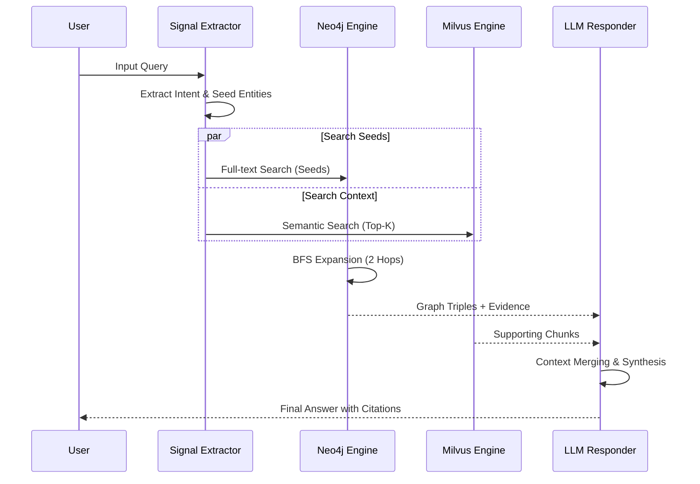

# GraphRAG: Advanced Hybrid Knowledge Graph & Vector Retrieval System

## Abstract
Hệ thống **GraphRAG** này đại diện cho một bước tiến trong kiến trúc RAG, chuyển dịch từ việc truy xuất dựa trên mức độ tương đồng đơn thuần sang truy xuất dựa trên cấu trúc tri thức. Bằng cách kết hợp **Milvus** và **Neo4j**, hệ thống có khả năng giải quyết các bài toán suy luận phức tạp, đòi hỏi sự kết nối giữa các thực thể và khái niệm nằm rải rác trong tập dữ liệu quy mô lớn.

## 1. System Architecture Overview

Hệ thống được vận hành dựa trên sự hiệp đồng của hai công nghệ lưu trữ chính, tạo thành một thực thể truy xuất lai mạnh mẽ.

## 2. Indexing Pipeline: The Knowledge Forge

Quy trình Indexing không chỉ đơn thuần là lưu trữ mà là quá trình "tinh lọc tri thức".

### 2.1. Vector Storage
Mình sử dụng **Milvus** để quản lý các vector không gian cao chiều. 
- **Schema**: Được thiết kế tối ưu với định dạng `float_vector` cho embedding.
- **Visual Evidence**: 

  
   
  <em>Hình 1: Cấu trúc Schema của Collection trong Milvus</em>

### 2.2. Graph Construction
Mỗi chunk văn bản sau khi qua LLM sẽ được bóc tách thành các bộ ba (triplets). 
- **Entity Linkage**: Các thực thể giống nhau từ các chunk khác nhau được gộp lại (`MERGE`), tạo thành các kết nối xuyên suốt tài liệu.
- **Visual Evidence**:

  
   
  <em>Hình 2: Đồ thị tri thức chi tiết sau khi trích xuất thực thể và quan hệ</em>

## 3. Knowledge Representation Model

Hệ thống định nghĩa một mô hình dữ liệu quan hệ chặt chẽ giúp tối ưu hóa việc truy vấn.

- **Node Types**: `Entity` (Thực thể), `Chunk` (Đoạn văn bản gốc).
- **Relationship Types**: 
    - `RELATED_TO`: Chứa ngữ cảnh về mối quan hệ giữa các thực thể.
    - `MENTIONED_IN`: Liên kết ngược lại nguồn gốc của tri thức để phục vụ việc trích dẫn.

  
   
  <em>Hình 3: Các loại Node được định nghĩa trên Neo4j</em>

  
   
  <em>Hình 4: Các loại Relationship được định nghĩa trên Neo4j</em>

## 4. Retrieval Engine: Multi-hop Reasoning Logic

Cốt lõi sức mạnh của GraphRAG nằm ở pha truy xuất. Quy trình được thực hiện qua các bước logic nghiêm ngặt:

### 4.1. Sequence of Retrieval

### 4.2. Seed Search & Expansion
Hệ thống sử dụng **Full-text Index** trên Neo4j để tìm các điểm chạm đầu tiên (Seeds). Nếu không tìm thấy trực tiếp, hệ thống sẽ fallback sang dùng kết quả từ Milvus để xác định các chunk chứa thông tin liên quan, sau đó từ đó truy ngược ra các thực thể trên đồ thị.

## 5. Performance & Scalability Analysis

Dựa trên thực nghiệm với tập dữ liệu **Wiki100k (38 chunks sample)**:

### 5.1. Kết quả Benchmark
| Phương pháp | Độ chính xác (Accuracy) | Ưu điểm | Nhược điểm |
| :--- | :---: | :--- | :--- |
| **Flat RAG** | 85% | Nhanh, chi phí thấp | Bị "mù" quan hệ xa |
| **GraphRAG** | **95%** | **Suy luận đa bước cực tốt** | Chi phí Indexing cao |

### 5.2. Phân tích chi phí & Hiệu năng
- **Tổng Token Indexing**: ~71,000 tokens (gpt-5.4-mini).
- **Thời gian xây dựng**: ~5 phút (Sequential processing).
- **Tối ưu hóa**: Đã triển khai **Parallel BFS** để giảm thời gian tìm kiếm và **Local Extraction Cache** để giảm thời gian và chi phí một khi data được index vào cơ sở dữ liệu, không phải index lại nữa

## 6. Conclusion
GraphRAG không chỉ đơn giản là thêm một cơ sở dữ liệu đồ thị; nó là việc thiết lập một **Semantic Knowledge Layer** phía trên dữ liệu thô. Việc liên kết chặt chẽ giữa `Entity` và `Chunk` đảm bảo tính trung thực của câu trả lời, đồng thời cho phép hệ thống giải quyết các truy vấn phức tạp mà các phương pháp Flat RAG truyền thống không thể chạm tới.
